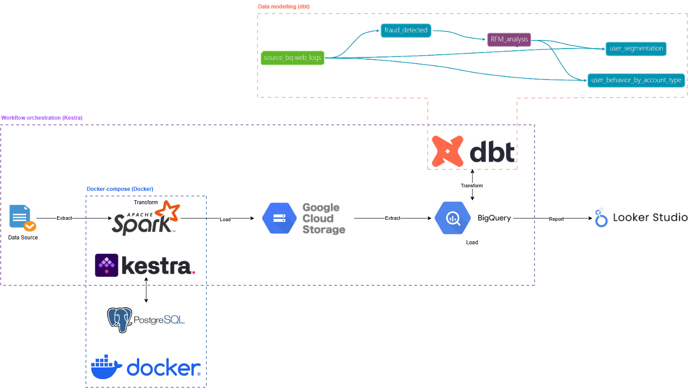

# E-commerce website logs analysis | Data Engineering GCP project

## Introduction
I built an end-to-end pipeline for E-commerce website logs, focusing on fraud detection, user behavior, and segmentation analysis. The batch process runs on a weekly schedule, leveraging GCP (GCS, BigQuery), Spark, dbt, Docker, Looker, and Kestra to filter fraudulent traffic, segment users via RFM analysis, and assess membership impact. The results: improved data integrity by eliminating fraudulent traffic, enhanced user analytics through precise segmentation, and optimized engagement strategies that drive retention and revenue growth.

## Problem description
The website faced challenges with fraudulent traffic and inefficient user segmentation, leading to poor analytics and revenue loss. This project implemented a robust fraud detection system and refined user segmentation, ensuring accurate insights and optimized targeting strategies.

## Architecture

## Technology used
1. Programming Language – Python
2. Query Language – SQL
3. Cloud Platform – Google Cloud Platform (GCP)
   - BigQuery
   - Google Cloud Storage (GCS)
   - Looker Studio
4. Data Processing & Transformation – Apache Spark, dbt
5. Workflow Orchestration – Kestra
6. Environment Management – Docker
7. Metadata & Workflow Storage – PostgreSQL (for Kestra)

## Running this project
To run the project, go to [instructions](INSTRUCTIONS.md). \
The instructions are beginner-friendly, so you will be able to run the project even if you have no experience with the mentioned technologies.

## Results
1. [Dashboard](https://lookerstudio.google.com/s/quHfV4HKzzA) in Looker Studio. Here you will find the analysis results and business recommendations.
2. BigQuery. If you have run the project, the transformed data will be available in your BigQuery instance for deeper exploration.

See [step 4 in the instructions](https://github.com/Hexagon9099/website_logs/blob/main/INSTRUCTIONS.md#step-4-exploring-the-project-results) for guidance on exploring the results.

## Detailed project description (optional)
### ⚙️ Data Preprocessing with Apache Spark
Before the data is loaded into the GCS Datalake, it undergoes preprocessing, cleaning, and normalization using Apache Spark, ensuring that even the first table in BigQuery contains clean, standardized data. Afterward, dbt models leverage the cleansed dataset to generate business analytics and insights.

Key data transformations in Spark: \
🔹 Data cleaning and normalization: fixing anomalies and standardizing values (e.g., `SafFRi` → `Safari`, etc.). \
🔹 Date handling: using `make_timestamp()` to correct timestamps. \
🔹 Null management: replacing `Unknown` with `NULL` for accurate gender analysis. \
🔹 Performance optimization: `repartition(10)` for efficient data distribution before writing to Parquet. 

### 📈 Advanced Business Analytics with dbt
### 1. Fraud Detection & Security Analysis 🕵️‍♂️
_How can we systematically detect and eliminate fraudulent traffic to ensure data integrity?_

🚨 Advanced Fraud Detection: I implemented a multi-layered detection model with a triple-criteria approach: \
🔹 High-frequency requests: IPs making over 3 requests per second flagged as bots. \
🔹 Unrealistic account usage: IPs accessing all 3 account types in one day. \
🔹 Suspicious session behavior: Users with top 25% session durations and data consumption. \
🚨 Only IPs meeting all 3 criteria are flagged as fraudulent.

💡 Why it matters? Reduces fraudulent data, ensuring accurate analytics, protecting revenue, and enhancing platform security.

### 2. Target Audience & User Segmentation 📊
_How can we segment users based on engagement and spending?_

🔹 RFM Analysis: Users classified by Recency, Frequency, Monetary (high, mid, low) to understand retention and revenue. \
🔹 Fraud exclusion: Ensures data integrity by excluding fraudulent traffic. \
🔹 Country Insights: Segmentation across countries, analyzing demographics like age and gender.

💡 Why it matters? Drives data-driven decisions, focusing on high-value users while optimizing engagement for lower segments.

### 3. Membership & User Behavior Analysis 💎
_How does membership type impact engagement and revenue?_

🔹 Account Type Segmentation: Users categorized by membership type (premium, normal, not logged in). \
🔹 Revenue & Retention: Analyzed LTV, ARPU, and retention metrics. \
🔹 Engagement Insights: Evaluated weekly retention rates and user behavior for each segment.

💡 Why it matters? Identifies key drivers of user value, informing strategies to optimize engagement and revenue across membership types.

## Code & Configurations (optional)
1. [End-to-end pipeline](workflows/3_ETL_end_to_end_pipeline.yml). This is the major pipeline, which shows you all the details about project inner processes. The visualization of all the processes going on in this pipeline is shown under the "[Architecture](#Architecture)" section as the contents of the purple dashed rectangle.
2. [dbt models](project_insides/dbt/web_logs/models). A detailed description of each model is available in the [schema](project_insides/dbt/web_logs/models/schema.yml) file. The interaction of these dbt models is shown in the "[Architecture](#Architecture)" section as the contents of the orange dashed rectangle.
3. [Docker-compose](docker-compose.yml). Docker-compose integrates Spark, Kestra, and Postgres services into a single network, ensuring that this project runs on your machine.The visualization of this integration is shown under the "[Architecture](#Architecture)" section as the contents of the blue dashed rectangle.
4. [GCP credentials workflow](workflows/1_gcp_kv.yml). An auxiliary workflow that allows you to configure the connection to your GCP.
5. [Infrastructure Automation](workflows/2_gcp_setup.yml). An auxiliary lightweight IaC workflow that automatically creates a GCS bucket and BigQuery dataset for this project.

